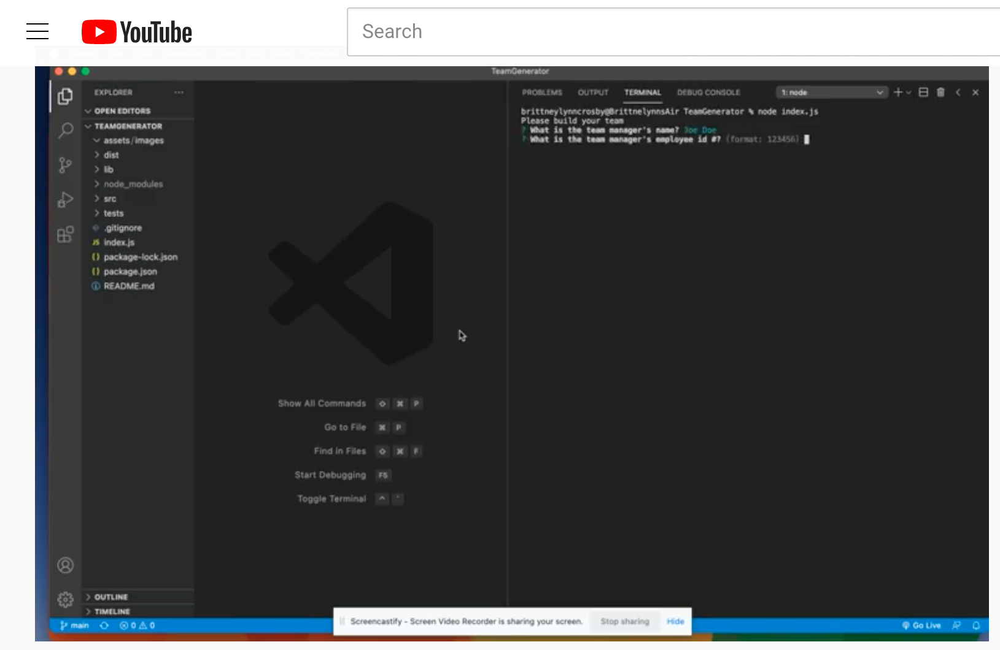
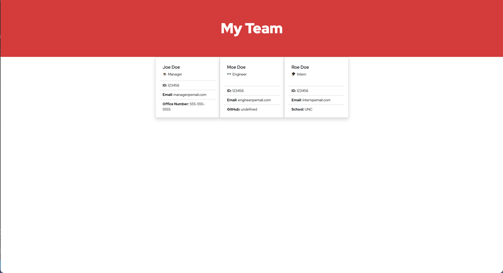

# TeamGenerator
**Brittneylynn Crosby**

<br />

## User Story

A Node.js command-line application that takes in information about employees on a software engineering team, then generates an HTML webpage that displays summaries for each person. 

<br />

**Important**: 

	* Uses the [Inquirer package](https://www.npmjs.com/package/inquirer).

	* Uses the [Jest package](https://www.npmjs.com/package/jest) for a suite of unit tests.

 The application will be invoked by using the following command:

```bash
node index.js
```

<br />

[](https://www.youtube.com/watch?v=aNHSrD5t4cw)


<br />
<br />

## Mock-Up

The following image shows a mock-up of the generated HTML’s appearance:



<br />


